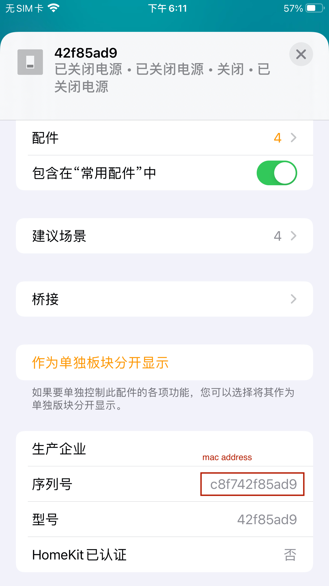

# 格力 Gree Air Conditioner Platform

支持

- 格力空调
- EWPE 可控制的空调

Supports

- gree air conditioners.
- all AC controlled by EWPE Smart APP.

## 安装 [Installation]

```
npm install homebridge-gree-air-conditioner -g
```

## 配置（简单）[Configuration (mininal)]

```
{
    "platforms": [
        {
            "platform": "GreeAirConditioner",
            "scanAddress": "192.168.1.255",
        }
    ]
}
```

**提示**

如何获取合适的扫描（广播）地址。

1. 猜，如果路由 ip 是 `192.168.1.1`， 那么扫描地址很可能是 `192.168.1.225`
2. 或 在终端中执行脚本查看，如下

   ```bash
   ifconfig | grep broadcast
   # 示例
   # inet 192.168.1.102 netmask 0xffffff00 broadcast 192.168.1.255
   ```

3. 或 直接使用 `255.255.255.255`

**Tips**

How to get your scan address (broadcast address)?

1.  You may guess it based on your router address. If your router ip address is `192.168.1.1`, the scan address is likely `192.168.1.255`
2.  Or，run the code below in your terminal:

    ```bash
    ifconfig | grep broadcast
    # example result
    # inet 192.168.1.102 netmask 0xffffff00 broadcast 192.168.1.255
    ```

3.  Or, just try `255.255.255.255`

## 配置（自定义） Configuration (optional)

可使用

```
{
    "platforms": [
        {
            "platform": "GreeAirConditioner",
            "name": "My Gree",
            "port": 7002,
            "scanCount": 10,
            "scanTimeout": 3000,
            "scanAddress": "192.168.1.255",
            "defaultValue": {
                "minimumTargetTemperature": 16,
                "maximumTargetTemperature": 30,
                "sensorOffset": 40,
                "defaultSpeed": 3,
                "defaultVerticalSwing": 0,
                "statusUpdateInterval": 3,
                "switches": "power,verticalSwing,horizontalSwing,quietMode,powerfulMode,light,dryMode,fanMode"
            },
            "devices": [
                {
                    "mac": "c8f742xxxxxx",
                    "sensorOffset": 40,
                    "defaultSpeed": 3,
                    "disabled": false,
                }
            ]
        }
    ]
}
```

**Caution**: remember to set `minimumTargetTemperature`, `maximumTargetTemperature` manually if you are using _Fahrenheit_ unit.

原遥控器功能在插件中的实现情况，可查看文档： [功能文档](./feature-mapping.md)

More info about what features have been implemented comparing to remote control, Ref: [功能文档](./feature-mapping.md)

## Q&A

### 获取设备 MAC 地址 [GET MAC ADDRESS of device]

A. 如果当前插件已经启用，并已成功添加设备。可在 家庭 应用中查看。

A. From Home App Accessory, if this plugin has enabled and successfuly added your device.



B. 从 Gree+ 应用中获取

B. From Gree+ App


### 为什么没有风速自动模式 [Why no fan speed auto mode?]

将风速为 `0`，即为自动模式

Set fan speed to `0`.

### “风速”总是与“送风模式”联动？[Does "fanSpeed" always link with the "Fan mode"?]

是的，“风速”只会在有送风模式的设备上创建。因为，Homekit 里面的 HeaterCooler 没有这个“送风模式”。 如果觉得有干扰，可以取消设备设置里面的送风模式，相关组件会被自动删除。 HeaterCooler 支持的模式可以在 HeaterCooler 下进行风速调节。

Yes. The "FanSpeed" is created for "Fan Mode", as the HeaterCooler in homekit does not support this mode. If you feel confusing, you may disable the `FanMode` toggle in device configuration. If so, the related accessories will be removed automatically. Fan speed for modes that HeaterCooler supports, should be set inside HeaterCooler accessory.

### 可以一次设置 Sub Accessory Prefix 吗？

可以。设置样式 `<device>[start:end]`, 示例：

- `<device>[0:3]` 设备名称前三个字符
- `<device>[-3:]` 设备名称后三个字符
- `<device>[3, 6]` 中间一段字符

## Features/TODO

- [x] 设备独立设置
- [x] 缓存模式状态，在切换模式时 像遥控器那样 保留原模式下的设置
- [x] 本地化语言，支持简体中文以及英文，方便通过 Siri 控制模式开关。 如 ”Siri， 打开静音模式“
- [x] 可配置功能开关的启用。示例：当 `switches` 设置为 `power,light` 时， 仅启用电源，灯光控制开关，其他强劲模式、静音模式等开关均不启用。

- [x] 电源控制
- [x] 温度调节 （可选择摄氏温度或华氏温度）
- [x] 模式调节 （不支持 送风，除湿）
- [x] 送风模式、除湿模式开关
- [x] 风速调节
- [x] 静音模式
- [x] 强劲模式
- [x] 左右扫风
- [x] 上下扫风
- [x] 指示灯控制
- [x] 默认风板位置，当退出自动模式时，风板回到预设的模式
- [x] 睡眠模式
- [x] XFan 开关

## 开发

1. 安装 homebridge 以及 homebridge-config-ui-x

```bash
npm install -g homebridge homebridge-config-ui-x
```

2. 准备配置文件

```
cp homebridge/config.json.example homebridge/config.json
```

2. 启动开发服务

```
npm run watch
```

## Refs & Credits

- [gree-remote](https://github.com/tomikaa87/gree-remote)
- [homebridge-gree-heatercooler-v2](https://github.com/Elethom/homebridge-gree-heatercooler-v2)
- [Homebridge YeeLight Wi-Fi](https://github.com/vieira/homebridge-yeelight-wifi)
