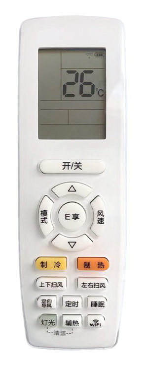

# 空调遥控器按键 及 实现

下面的标题与遥控器上的按键对应，上下排序与案件在遥控器上位置大致一直。 **Homekit 组件** 列表插件中为实现相应功能而 使用 Accessory。如果没有相关列表，即表示插件中无相关功能的实现。

遥控器参考图片（图片来自于网络）：

## 开/关

控制电源开关。

| label | en  | code         |
| ----- | --- | ------------ |
| 开    | ON  | `{ Pow: 1 }` |
| 关    | OFF | `{ Pow: 0 }` |

### Homekit 组件

- 电源 Power (Switch)

## 模式

模式切换。模式切换时会保存原模式的温度设置、风速等数据。

| label | en   | code                                                 |
| ----- | ---- | ---------------------------------------------------- |
| 自动  | auto | `{ Mod: 0, SetTem: 25, WdSpd: 3, Tur: 0, Quiet: 0 }` |
| 制冷  | cool | `{ Mod: 1, SetTem: 28, WpSpd: 0, Tur: 0, Quiet: 0 }` |
| 除湿  | dry  | `{ Mod: 2, SetTem: 25, WpSpd: 3, Tur: 0, Quiet: 0 }` |
| 送风  | fan  | `{ Mod: 3, SetTem: 26, WpSpd: 3, Tur: 0, Quiet: 0 }` |
| 制热  | heat | `{ Mod: 4, SetTem: 27, WpSpd: 3, Tur: 0, Quiet: 0 }` |

### Homekit 组件

- 模式 Mode (HeaterCooler)
- 送风模式 fanMode (Switch)
- 干燥模式 DryMode (Switch)

## △ | ▽

调整目标温度

### Homekit 组件

- 模式 Mode (HeaterCooler)

## 风速

- 自动模式下，风速在 “自动”，“1 级”，“2 级”，“3 级”，“4 级”，“5 级” 之间循环
- 制冷模式下，风速在 “自动”，“静音”，“1 级”，“2 级”，“3 级”，“4 级”，“5 级”，“强劲” 之间循环
- 除湿模式下，风速只能停留在“1 级”
- 送风模式下，风速在 “自动”，“1 级”，“2 级”，“3 级”，“4 级”，“5 级” 之间循环
- 制热模式下，风速在 “自动”，“静音”，“1 级”，“2 级”，“3 级”，“4 级”，“5 级”，“强劲” 之间循环

| label | en       | code                             |
| ----- | -------- | -------------------------------- |
| 自动  | Auto     | `{ Quiet: 0, Tur: 0, WdSpd: 0 }` |
| 静音  | Quiet    | `{ Quiet: 2, Tur: 0, WdSpd: 1 }` |
| 1 级  | L1       | `{ Quiet: 0, Tur: 0, WdSpd: 1 }` |
| 2 级  | L2       | `{ Quiet: 0, Tur: 0, WdSpd: 2 }` |
| 3 级  | L3       | `{ Quiet: 0, Tur: 0, WdSpd: 3 }` |
| 4 级  | L4       | `{ Quiet: 0, Tur: 0, WdSpd: 4 }` |
| 5 级  | L5       | `{ Quiet: 0, Tur: 0, WdSpd: 5 }` |
| 强劲  | Powerful | `{ Quiet: 0, Tur: 1, WdSpd: 5 }` |

### Homekit 组件

- 风扇 Fan (FanV2)
- 强劲模式 PowerMode (Switch)
- 静音模式 SilentMode (Switch)

## 制冷、制热

模式切换按钮，分别与模式中的 “制冷”， “制热” 对应

## 上下扫风

| label | code            |
| ----- | --------------- |
| 开    | `{ SwUpDn: 1 }` |
| 关    | `{ SwUpDn: 0 }` |

### Homekit 组件

- 上下扫风 VerticalSwing (Switch)

## 左右扫风

| label | code                |
| ----- | ------------------- |
| 开    | `{ SwingLfRig: 1 }` |
| 关    | `{ SwingLfRig: 0 }` |

### Homekit 组件

- 左右扫风 HorizontalSwing (Switch)

## 定向导风

| label | code            | 遥控 | app |
| ----- | --------------- | ---- | --- |
| 上    | `{ SwUpDn: 2 }` | x    | x   |
| 中上  | `{ SwUpDn: 3 }` | o    | x   |
| 中    | `{ SwUpDn: 4 }` | x    | x   |
| 中下  | `{ SwUpDn: 5 }` | o    | x   |
| 下    | `{ SwUpDn: 6 }` | x    | x   |

无 Homekit 组件。 目前只提供了默认位置的设置。当关闭上下送风时，导风板会自动归位到设定的位置

## 定时

定时开关机，与 APP 上的“预约”为同一个功能 [参考文件](https://github.com/tomikaa87/gree-remote#scheduling)

在**家庭**应用中可以使用的 “自动化 Automation” 实现相似的功能。

## 睡眠

睡眠模式的切换

| label | code            |
| ----- | --------------- |
| 开    | `{ SwhSlp: 1 }` |
| 关    | `{ SwhSlp: 0 }` |

睡眠模式下的四个档位，具体对应的 ColCode 不明

- 睡眠 1 - 舒睡模式
- 睡眠 2 - 舒醒模式
- 睡眠 3 - 自定义模式
- 睡眠 4 - 午睡模式

### Homekit 组件

- 睡眠模式 SleepMode (Switch)

说明：目前只能控制睡眠模式的开关，无法切换睡眠模式。

## 灯光

面板灯光显示

| label | code         |
| ----- | ------------ |
| 开    | `{ Lig: 1 }` |
| 关    | `{ Lig: 0 }` |

### Homekit 组件

- 指示灯 Light (Switch)

## 辅热

制热模式下的功能。

## 凉感

凉感对应的 ColCode 不明
